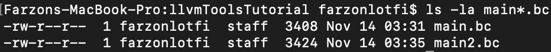
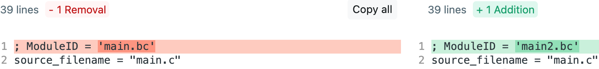
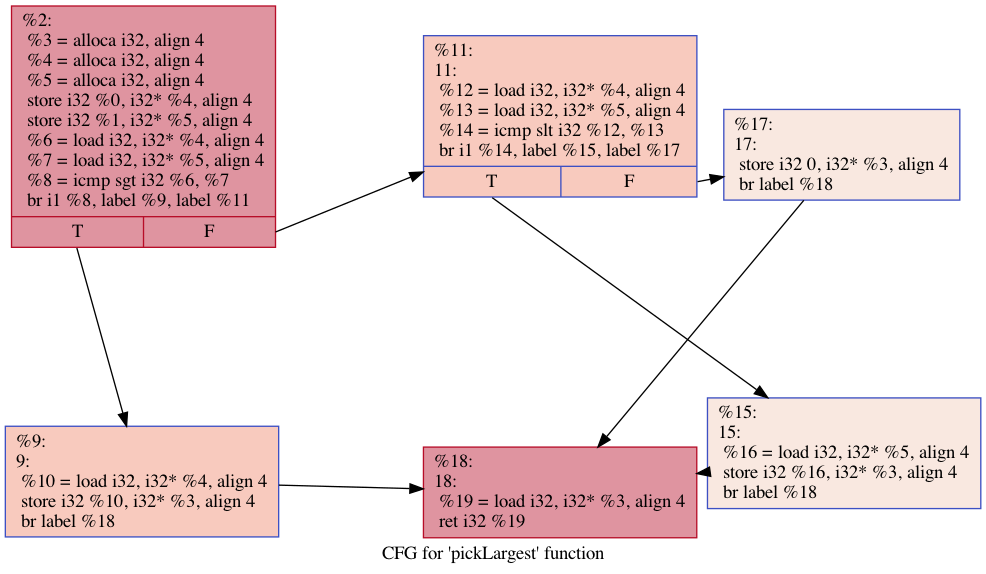

# LLVM IR Tools Tutorial
Lets start with the following example
```c
#include <stdio.h>

int add(int a, int b) {
  return a + b;
}

int main() {
  printf("%d\n",add(5,4));
  return 0;
}


```
## Example 1: How to Emit LLVM bit code
```bash
clang -emit-llvm -c main.c
```
## Example 2: How to Visualize LLVM IR from bit code
```bash
$(brew --prefix llvm)/bin/llvm-dis main.bc  -o main.ll
```


### What makes up LLVM IR
Every llvm IR Starts with a module.
The IR file has the following header
- Module ID
- Source file name, 
- data layout format
- target triple.

```llvm
; ModuleID = 'main.bc'
source_filename = "main.c"
target datalayout = "e-m:o-p270:32:32-p271:32:32-p272:64:64-i64:64-f80:128-n8:16:32:64-S128"
target triple = "x86_64-apple-macosx11.0.0"
```

### what does the add function look like?
Every function starts with a define.
- the return type in this case i32.
- the `@` function name
- the parameter list
- function body
    - allocates space in the function body
    - store\load the parameters into the new allocated space
    - add the parameters
    - return the result
```llvm
define i32 @add(i32 %0, i32 %1) #0 {
  %3 = alloca i32, align 4
  %4 = alloca i32, align 4
  store i32 %0, i32* %3, align 4
  store i32 %1, i32* %4, align 4
  %5 = load i32, i32* %3, align 4
  %6 = load i32, i32* %4, align 4
  %7 = add nsw i32 %5, %6
  ret i32 %7
}
```

## Example 3: How to convert from IR to bitcode
```bash
$(brew --prefix llvm)/bin/llvm-as main.ll  -o main2.bc
```
## Will main.bc and main2.bc be the same?
No they will not, transformations in llvm are rarely bi-directional. Especially with different tools.

As we see below the file sizes are different, The llvm assembler makes the file slightly bigger than 
just having clang emit the IR.


However if we were to convert back to IL the only difference we would see is the module ID.



## Example 4: what if add was defined in a new file
The first question is how would we link, and can we link bit code. The answer is yes you use `llvm-link`
This tool is the basis behind the wllvm work.
- add.c
```c
int add(int a, int b) {
  return a + b;
}
```
- main.c
```c
#include <stdio.h>
extern int add(int a, int b);

int main() {
  printf("%d\n",add(5,4));
  return 0;
}

```

```bash
clang -emit-llvm -c main.c 
clang -emit-llvm -c add.c
$(brew --prefix llvm)/bin/llvm-link main.bc add.bc -o exec.bc
```

## Example 5: how do we run bit code?
```bash
$(brew --prefix llvm)/bin/lli exec.bc
```


## Example 6: can we go from bitcode to assembly?
Yes! You have to use `llc` a staic compiler
https://llvm.org/docs/CommandGuide/llc.html

```bash
$(brew --prefix llvm)/bin/llc exec.bc -o exec.s
```

The interesting thing about llc is it comments the assembly with things like basic block info.

```bash
grep -A17 "_add:" exec.s 

_add:                                   ## @add
	.cfi_startproc
## %bb.0:
	pushq	%rbp
	.cfi_def_cfa_offset 16
	.cfi_offset %rbp, -16
	movq	%rsp, %rbp
	.cfi_def_cfa_register %rbp
	pushq	%rax
	movl	%edi, -8(%rbp)
	movl	%esi, -4(%rbp)
	movl	-8(%rbp), %eax
	addl	-4(%rbp), %eax
	addq	$8, %rsp
	popq	%rbp
	retq
	.cfi_endproc
                                        ## -- End function
```

Lets try an example with slightly more basic blocks
```c
int pickLargest(int a, int b) {
  if(a > b) {
    return a;
  } else if (a < b) {
    return b;
  } else {
    return 0;
  }
}
```

```bash
grep -A34 "_pickLargest:" exec.s

_pickLargest:                           ## @pickLargest
	.cfi_startproc
## %bb.0:
	pushq	%rbp
	.cfi_def_cfa_offset 16
	.cfi_offset %rbp, -16
	movq	%rsp, %rbp
	.cfi_def_cfa_register %rbp
	subq	$12, %rsp
	movl	%edi, -8(%rbp)
	movl	%esi, -4(%rbp)
	movl	-8(%rbp), %eax
	cmpl	-4(%rbp), %eax
	jle	LBB0_2
## %bb.1:
	movl	-8(%rbp), %eax
	movl	%eax, -12(%rbp)
	jmp	LBB0_5
LBB0_2:
	movl	-8(%rbp), %eax
	cmpl	-4(%rbp), %eax
	jge	LBB0_4
## %bb.3:
	movl	-4(%rbp), %eax
	movl	%eax, -12(%rbp)
	jmp	LBB0_5
LBB0_4:
	movl	$0, -12(%rbp)
LBB0_5:
	movl	-12(%rbp), %eax
	addq	$12, %rsp
	popq	%rbp
	retq
	.cfi_endproc
                                        ## -- End function
```

## Example 7: what is opt and whant can I do with it?
Compilers are typically setup as a frontend a middle and a backend.
An important part of the middle is the optimizer. opt is that optimizer.
That said it doesn't just do code transformations. It can also do analysis.

During the hackathon we made control flow graphs (CFGs) via dot files using dynamic binary instrumentation. Well you can also generate them statically like so

```bash
$(brew --prefix llvm)/bin/opt -enable-new-pm=0 -analyze -dot-cfg exec.bc
sfdp -x -Tpng -Goverlap=prism .pickLargest.dot>  pickLargest.png
```
Output:
```bash
Writing '.pickLargest.dot'...
Printing analysis 'Print CFG of function to 'dot' file' for function 'pickLargest':
Writing '.main.dot'...
Printing analysis 'Print CFG of function to 'dot' file' for function 'main':
Writing '.add.dot'...
Printing analysis 'Print CFG of function to 'dot' file' for function 'add':
```


## Example 8: Going beyond the CLI
So these cli tools are all great can we do analysis programatically?
More importantly can we do it without writing native code?
Yes to both questions. Introducing `llvmlite` https://github.com/numba/llvmlite

A simple bit code parser:
```python
import sys
import llvmlite.binding as llvm

def ParseBC(bc : str) -> llvm.ModuleRef:
    try:
        module = llvm.parse_bitcode(bc)
        return module
    except Exception as e:
         return None

def Parse(path : str):
    module = None
    with open(path, 'rb') as f:
        module = ParseBC(fileStr)
    return module

def print(module : llvm.ModuleRef):
    for f in module.functions:
        for b in f.blocks:
            *_, last = b.instructions
            print(f'last instruction: {last}')
            print("operands: %s" % [op.name for op in last.operands])
            break
        break

def main():
    module = Parse(sys.argv[1])
    print(module)

if __name__=="__main__":
    main()
```
requirements.txt
```
llvmlite==0.39.1
```
run it:
```bash
python3 -m venv env
source env/bin/activate
pip install -r requirements.txt
python parser.py add.bc
```